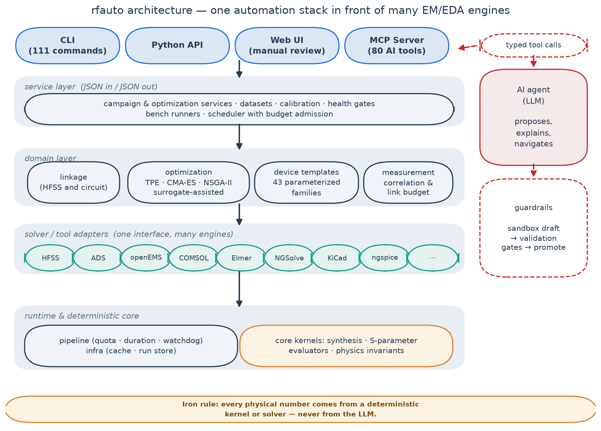
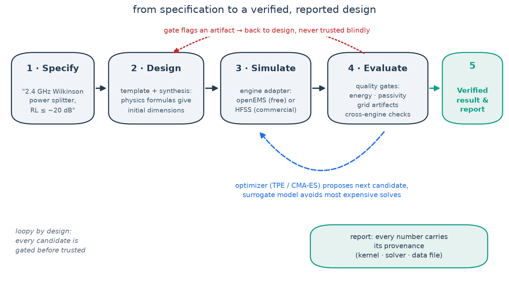
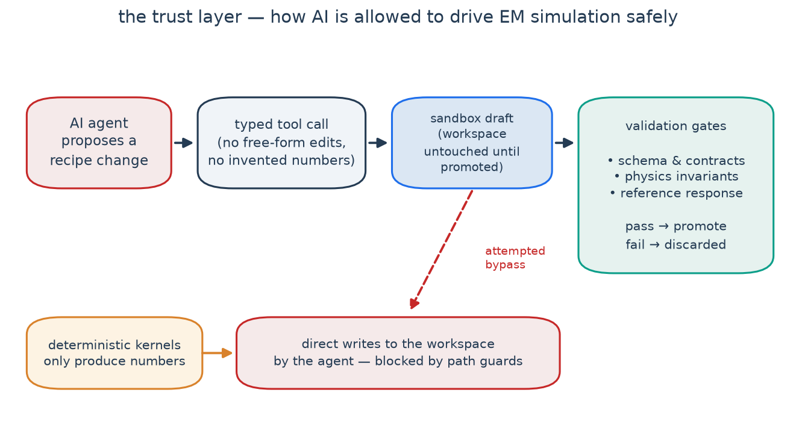

# rfauto

[]()
[]()
[]()
[]()

English | [简体中文](README.zh-CN.md)

**rfauto is an automation framework for RF/microwave design and simulation.**
Describe a device, get a first-cut geometry from physics formulas, simulate it
with whichever solver you have, check the result for numerical artifacts, and
let an optimizer tune the dimensions — with AI assistants allowed to drive the
whole pipeline through MCP, under one hard rule:

> **Every physical number (frequency, loss, geometry) is produced by a
> deterministic kernel or solver — never by the LLM.**

It drives **13 EM/EDA engines** behind one interface, ships
**43 parameterized device templates** with built-in physics checks, and
exposes **111 CLI commands** and **80 MCP tools** (+3 resources) — kept
honest by **7400+ unit tests** that run without any commercial license.

**Contents** · [Why](#why) · [What it does](#what-it-does) ·
[Trust layer](#the-trust-layer) · [Quick start](#quick-start) ·
[The Web UI](#the-web-ui) · [Engines](#engines) · [Docs](#documentation) ·
[Roadmap](#status--roadmap) · [Contributing](#contributing)



## Why

RF simulation work is full of manual repetition and quiet traps:

- Every iteration means redrawing geometry, re-running a solver that takes
  minutes to hours, and reading numbers out by hand.
- Each vendor tool has its own API and quirks; switching engines means
  rewriting your workflow.
- Solvers fail silently in confusing ways — a bad mesh or a wrong port can
  produce plausible-looking garbage.
- The good solvers need expensive licenses; the free ones deserve distrust
  until verified.

rfauto turns that loop into code: templates build the geometry, adapters talk
to the engines, quality gates judge the results, optimizers close the loop,
and every reported number carries its provenance.

## What it does

- **One interface, many engines** — HFSS, ADS, openEMS, COMSOL, Elmer,
  NGSolve, Meep, Icepak, Q3D, Palace, KiCad, ngspice and FDTDX (JAX) behind a
  common adapter layer. Commercial engines stay opt-in extras; everything
  core runs against a built-in fake solver, so you can try the whole framework
  with zero licenses.
- **Device template factory** — 43 parameterized families (couplers, power
  dividers, filters, antennas, transitions…). Each template synthesizes
  starting dimensions from closed-form physics, and registers acceptance
  checks so you can tell "real result" from "mesh artifact".
- **Optimization loops** — TPE, CMA-ES and multi-objective NSGA-II, with a
  surrogate-model path: fit a cheap model from a batch of solves, then search
  the model instead of re-solving. Batch campaigns run unattended with budget
  admission, quotas and watchdogs.
- **Quality gates everywhere** — energy and passivity checks, grid-artifact
  diagnostics, cross-engine arbitration (compare the same geometry on a second
  solver), and physics-invariant tests. A result that fails a gate is reported
  as failed, never silently passed.
- **AI that drives but doesn't invent** — a full MCP server so Claude Desktop,
  Cursor or your own agent can operate the framework. Agent edits go through a
  sandbox draft and validation gates before they touch your workspace.



## The trust layer

The part we care about most: how do you know a simulation result is
*believable*? rfauto treats that as a first-class feature — health gates on
every run, reference responses per template, deterministic kernels for every
number, and a sandbox-plus-gates path for anything an AI agent wants to change.



## Quick start

No commercial tools needed — the built-in fake solver covers the whole core.

```bash
git clone https://github.com/geer1895/rfauto && cd rfauto
pip install -e ".[dev]"          # or: uv sync --extra dev

# run the test suite (~7400 tests, no EDA required)
python -m pytest tests/unit -q

# check which solvers/licenses are visible on your machine
rfauto doctor
```

Synthesize a 50 Ω microstrip line at 2.4 GHz (pure math, instant):

```bash
$ rfauto syn mline 50.0 --freq 2.4 --stackup rogers4350b_h0.508
微带线综合结果 (rogers4350b_h0.508 @ 2.4 GHz)
  目标阻抗: 50.00 Ω
  线宽:     1.1133 mm
  εeff:     2.8530
  状态:     ok
```

Run a Wilkinson power-divider simulation without any solver installed
(the fake adapter answers instantly; plug in openEMS or HFSS later for real
physics):

```bash
$ rfauto run recipes/wilkinson_pd_v1.yaml --adapter fake
✓ 仿真完成  run_id: 20260921_001708_3fe788d3
  指标:
    s11_db_max_in_band: -12.21
    s21_db_mean_in_band: -3.67
    iso_s23_db_min_in_band: 28.07
```


From there, the usual loop:

```bash
rfauto sweep recipes/wilkinson_pd_v1.yaml --adapter fake   # parameter sweep
rfauto tune  recipes/wilkinson_pd_v1.yaml --max-trials 60  # optimization loop
rfauto replay <run_id>                                     # reproduce a past run
```

### Connect an AI assistant (optional)

```bash
pip install -e ".[mcp]"
python -m rfauto.mcp_server        # stdio transport; 80 tools
```

Then register it in your MCP client (Claude Desktop example):

```json
{
  "mcpServers": {
    "rfauto": {
      "command": "python",
      "args": ["-m", "rfauto.mcp_server"],
      "cwd": "/path/to/rfauto"
    }
  }
}
```

## The Web UI

`rfauto ui` opens a local review workbench — no data leaves your machine.
Inspect every run's metrics and curves, compare adapters, run the built-in
microwave calculators, and review AI-agent proposals before promoting them:

```bash
rfauto ui          # http://127.0.0.1:8642 — local only
```

| | |
|---|---|
|  |  |
|  |  |

Every page is deep-linkable (`#runs`, `#sparams`, `#tools`, …), so you can
bookmark the view you care about.

## Engines

| Engine | License | Typical role |
|---|---|---|
| HFSS (Ansys AEDT) | commercial | full-wave reference / arbitration |
| ADS (Keysight) | commercial | circuit & system co-simulation |
| openEMS | open (GPL, runs in a subprocess) | fast FDTD batch solving |
| COMSOL | commercial | FEM multiphysics |
| Elmer | open | multiphysics FEM |
| NGSolve | open | frequency-domain FEM |
| Meep | open | FDTD (Linux) |
| Icepak / Q3D (Ansys) | commercial | thermal / field extraction |
| Palace | open | parallel FEM |
| KiCad | open | PCB DRC & layout extraction (subprocess) |
| ngspice | open | circuit simulation |
| FDTDX (JAX) | open | differentiable FDTD |

Commercial tools need your own valid license; the framework neither includes
nor circumvents any license, and no vendor-proprietary content is distributed
in this repository (see [THIRD_PARTY_NOTICES.md](THIRD_PARTY_NOTICES.md)).

## Documentation

- [Templates reference](docs/rf_template_references.md) — per-template
  acceptance values and modeling rules
- [openEMS build guide](docs/openems_build_guide.md)
- [COMSOL notes](docs/comsol_references.md) · [Migration guide](docs/migration_guide.md)
- [Template metadata](docs/templates/) — one `meta.yaml` per device family
- [Changelog](CHANGELOG.md) · [Contributing](CONTRIBUTING.md)

## Status & roadmap

rfauto is a working tool, not a demo: the core chain (template → synthesis →
solve → quality gates → optimization → report) runs on real HFSS, ADS,
openEMS, COMSOL and KiCad installs, backed by the test suite above. It is
Windows-first today, single-maintainer, and moving toward Linux/Docker
friendliness.

Planned next, in the open:

- **Datasets & benchmarks** — the simulation datasets collected by the
  built-in data-factory pipeline and the agent evaluation sets are not part
  of this repository yet; we plan to release them progressively, and would
  love collaborators to help shape and curate them.
- **Methodology paper** — a write-up of the quality-gate / deterministic-
  kernel methodology is planned; contributions and co-authoring welcome.
- **More device families, more engines, better onboarding** — all good first
  issues.

If any of this sounds interesting to you, open an issue — we'd like this to
become a community project, not a solo archive.

## Contributing

Issues and pull requests are welcome — see
[CONTRIBUTING.md](CONTRIBUTING.md) for the quick start, project rules and
the meaning of the `#NNN` markers in code comments.

## Citation

If rfauto helps your research, please cite it — see
[CITATION.cff](CITATION.cff).

## License

rfauto is licensed under **GPL-3.0-only** (see [LICENSE](LICENSE)).
Third-party package licenses are listed in
[THIRD_PARTY_NOTICES.md](THIRD_PARTY_NOTICES.md). Note that the optional
openEMS adapter drives GPL-licensed openEMS through a separate subprocess;
the openEMS bindings themselves are not included in this repository and are
built from the official openEMS source by the user.
