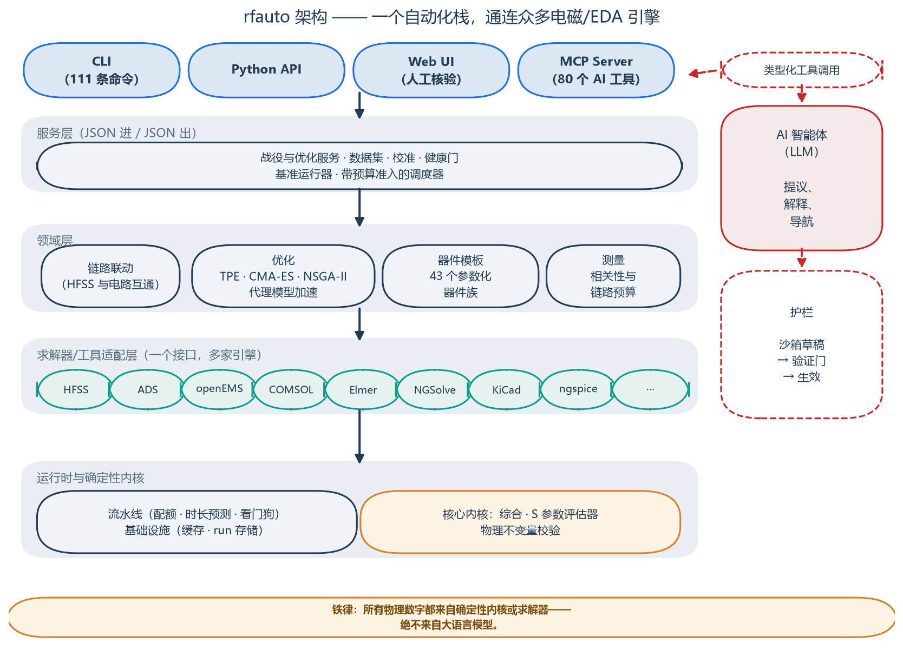
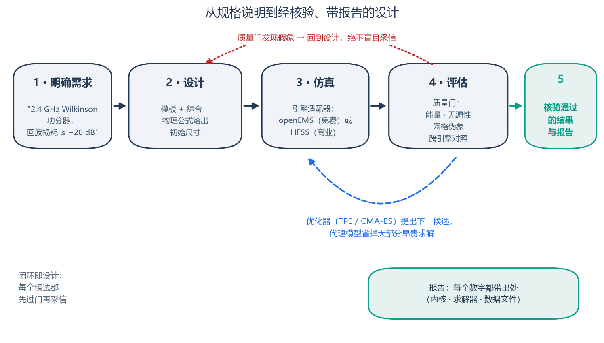
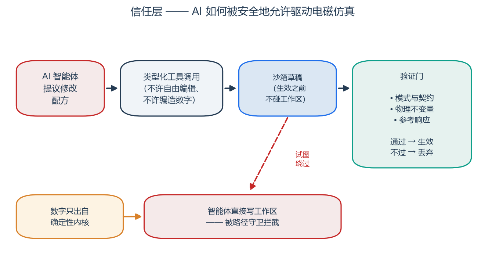
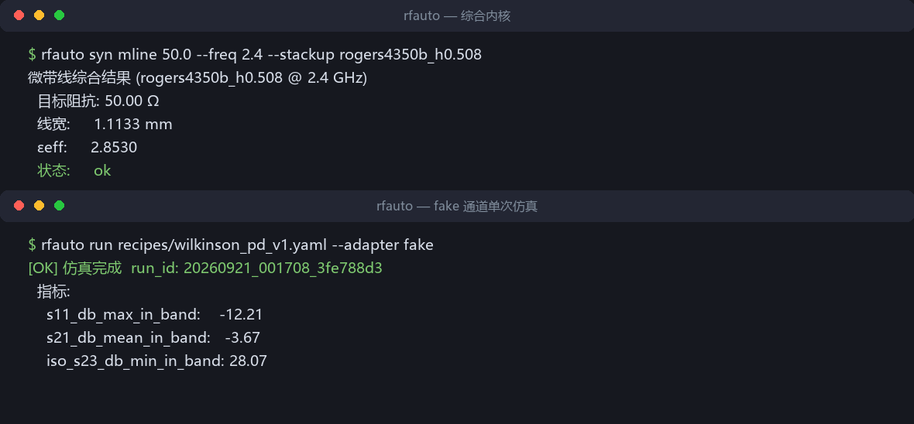
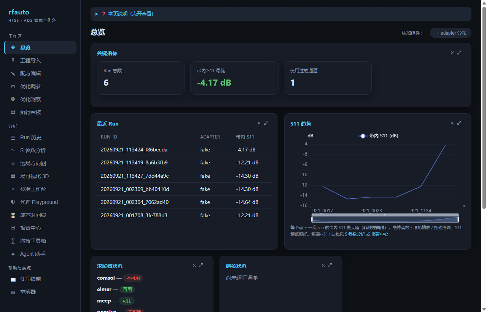
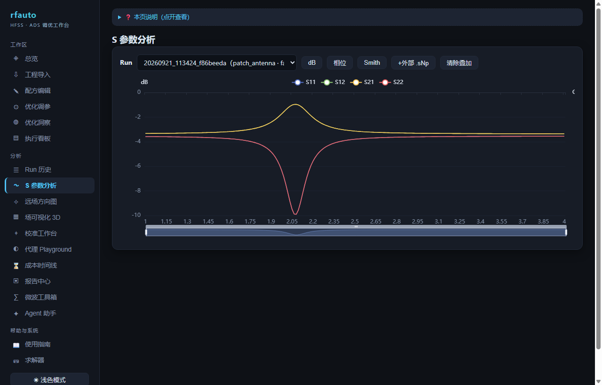
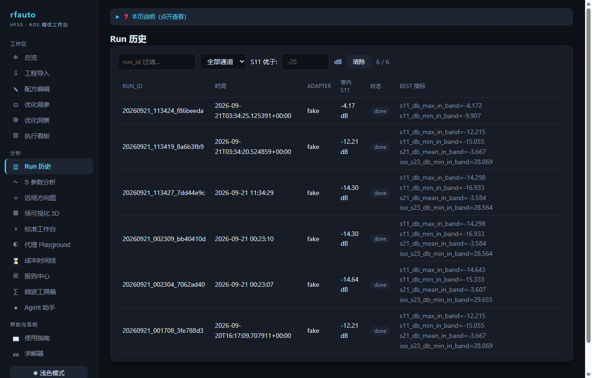
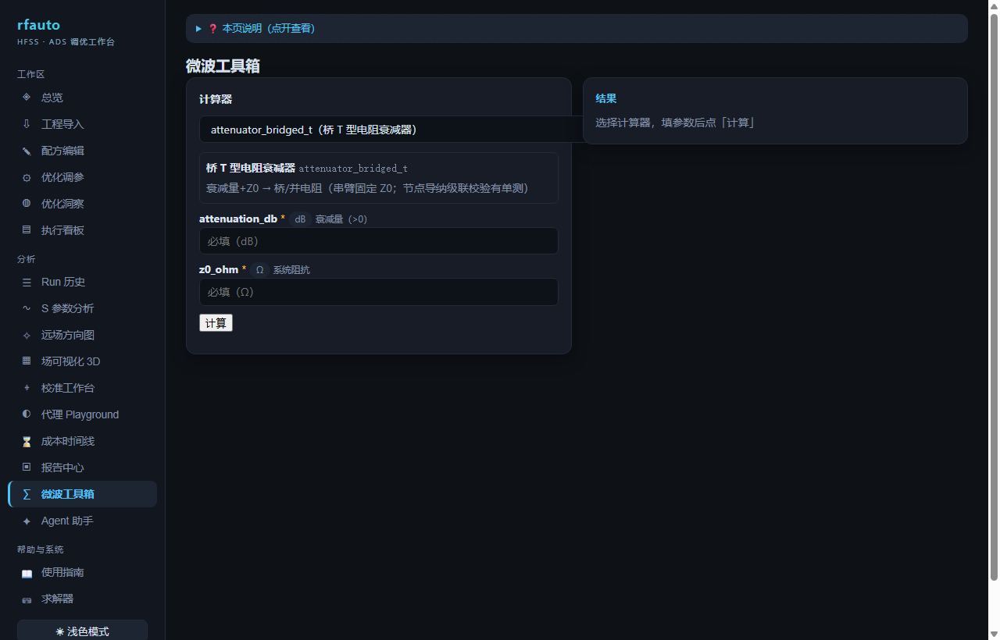

# rfauto

[]()
[]()
[]()
[]()

[English](README.md) | 简体中文

**rfauto 是一个射频/微波设计与仿真的自动化框架。** 描述你要的器件，它用物理公式
算出第一版尺寸，调用你手头有的求解器做仿真，自动检查结果是不是数值假象，再让
优化器把尺寸调到位——AI 助手可以通过 MCP 指挥整个流程，但只有一条铁律：

> **所有物理数字（频率、损耗、几何尺寸）都由确定性公式内核或求解器产生，
> 永远不由大语言模型编造。**

它把 **13 个电磁/EDA 引擎**接到同一个接口后面，内置 **43 个参数化器件模板**和
配套的物理验收判据，提供 **111 条 CLI 命令**和 **80 个 MCP 工具**（+3 个
resources），并靠 **7400+ 条单元测试**保持诚实——这些测试不需要任何商业许可
就能跑。

**目录** · [为什么做](#为什么做这个) · [它能做什么](#它能做什么) ·
[信任层](#信任层) · [快速开始](#快速开始) · [Web UI](#web-ui) ·
[引擎](#引擎) · [文档](#文档) · [路线图](#现状与路线图) · [参与贡献](#参与贡献)



## 为什么做这个

射频仿真日常充满重复劳动和悄无声息的坑：

- 每迭代一轮 = 重画几何 + 等几分钟到几小时的求解 + 手工抄数字；
- 每家商用工具各有一套 API 和怪癖，换引擎就要重写一遍流程；
- 求解器会"安静地"出错——网格不好、端口设错，产出的垃圾数据和真结果一样
  看起来很合理；
- 好用的求解器要商业许可，免费的求解器在验证之前又不敢信。

rfauto 把这个循环变成代码：模板负责建几何，适配层负责跟引擎打交道，质检门负责
判断结果可不可信，优化器负责闭环，报告里的每个数字都带出处。

## 它能做什么

- **一个接口，多家引擎** —— HFSS、ADS、openEMS、COMSOL、Elmer、NGSolve、
  Meep、Icepak、Q3D、Palace、KiCad、ngspice、FDTDX（JAX）接在同一个适配层后面。
  商业引擎按需安装（可选依赖），核心功能全部跑在内置 fake 求解器上——零许可
  就能体验完整框架。
- **器件模板工厂** —— 43 个参数化器件族（耦合器、功分器、滤波器、天线、过渡
  结构……）。每个模板先用闭式物理公式综合出初始尺寸，并注册该器件族的验收
  判据，让你分得清"真结果"和"网格假象"。
- **优化闭环** —— TPE、CMA-ES、NSGA-II 多目标；还有代理模型路线：先用一批
  仿真结果拟合一个便宜的模型，然后在模型上搜索，省掉大部分昂贵求解。批量
  战役无人值守运行，带预算准入、配额和看门狗。
- **处处有质检门** —— 能量守恒与无源性检查、网格伪象诊断、跨引擎仲裁（同一
  几何拿到第二个求解器上对照）、物理不变量测试。没过门的结果如实报 FAIL，
  绝不静默放行。
- **AI 能指挥，但不许编数** —— 完整的 MCP 服务器，Claude Desktop、Cursor 或
  你自己的 agent 都能操作框架。agent 的修改先进沙箱草稿、过验证门，才允许
  碰你的工作区。



## 信任层

我们最看重的部分：怎么判断一个仿真结果*可信*？rfauto 把它做成一等公民——
每次运行都有健康门体检，每个模板有参考响应锚点，每个数字出自确定性内核，
AI 想改任何东西都要走沙箱加三道门。



## 快速开始

不需要任何商业工具——内置 fake 求解器覆盖全部核心功能。

```bash
git clone https://github.com/geer1895/rfauto && cd rfauto
pip install -e ".[dev]"          # 或者：uv sync --extra dev

# 跑测试套件（约 7400 条，不需要任何 EDA 软件）
python -m pytest tests/unit -q

# 探测本机可见的求解器与许可
rfauto doctor
```

综合一根 2.4 GHz 的 50 Ω 微带线（纯数学，瞬间出结果）：

```bash
$ rfauto syn mline 50.0 --freq 2.4 --stackup rogers4350b_h0.508
微带线综合结果 (rogers4350b_h0.508 @ 2.4 GHz)
  目标阻抗: 50.00 Ω
  线宽:     1.1133 mm
  εeff:     2.8530
  状态:     ok
```

不装任何求解器也能跑一次 Wilkinson 功分器仿真（fake 适配器即时返回；之后
接上 openEMS 或 HFSS 就是真实物理）：

```bash
$ rfauto run recipes/wilkinson_pd_v1.yaml --adapter fake
✓ 仿真完成  run_id: 20260921_001708_3fe788d3
  指标:
    s11_db_max_in_band: -12.21
    s21_db_mean_in_band: -3.67
    iso_s23_db_min_in_band: 28.07
```



接下来就是常规循环：

```bash
rfauto sweep recipes/wilkinson_pd_v1.yaml --adapter fake   # 参数扫描
rfauto tune  recipes/wilkinson_pd_v1.yaml --max-trials 60  # 优化外环
rfauto replay <run_id>                                     # 复现历史 run
```

### 连接 AI 助手（可选）

```bash
pip install -e ".[mcp]"
python -m rfauto.mcp_server        # stdio 传输；80 个工具
```

在 MCP 客户端里注册（Claude Desktop 示例）：

```json
{
  "mcpServers": {
    "rfauto": {
      "command": "python",
      "args": ["-m", "rfauto.mcp_server"],
      "cwd": "/path/to/rfauto"
    }
  }
}
```

## Web UI

`rfauto ui` 会启动一个本地核验工作台——数据不出你的机器。查看每次 run 的
指标与曲线、对比适配器、使用内置微波计算器，AI 代理的修改提案也在这里
先行核验再生效：

```bash
rfauto ui          # http://127.0.0.1:8642 — 仅本机
```

| | |
|---|---|
|  |  |
|  |  |

每个页面都支持深链接（`#runs`、`#sparams`、`#tools`…），可以收藏常用视图。

## 引擎

| 引擎 | 许可 | 典型角色 |
|---|---|---|
| HFSS（Ansys AEDT） | 商业 | 全波参考 / 仲裁基准 |
| ADS（Keysight） | 商业 | 电路与系统联合仿真 |
| openEMS | 开源（GPL，子进程运行） | 快速 FDTD 批量求解 |
| COMSOL | 商业 | FEM 多物理场 |
| Elmer | 开源 | 多物理场 FEM |
| NGSolve | 开源 | 频域 FEM |
| Meep | 开源 | FDTD（Linux） |
| Icepak / Q3D（Ansys） | 商业 | 热仿真 / 场提取 |
| Palace | 开源 | 并行 FEM |
| KiCad | 开源 | PCB DRC 与版图提取（子进程） |
| ngspice | 开源 | 电路仿真 |
| FDTDX（JAX） | 开源 | 可微 FDTD |

商业工具需要你自持合法许可；框架既不附带也不规避任何许可，本仓库不分发任何
厂商专有内容（见 [THIRD_PARTY_NOTICES.md](THIRD_PARTY_NOTICES.md)）。

## 文档

- [模板参考](docs/rf_template_references.md) —— 逐模板验收值与建模规则
- [openEMS 构建指南](docs/openems_build_guide.md)
- [COMSOL 备注](docs/comsol_references.md) · [迁移指南](docs/migration_guide.md)
- [模板元数据](docs/templates/) —— 每个器件族一份 `meta.yaml`
- [更新日志](CHANGELOG.md) · [参与贡献](CONTRIBUTING.md)

## 现状与路线图

rfauto 是能跑的工具，不是演示：核心链路（模板 → 综合 → 求解 → 质检门 →
优化 → 报告）在真实的 HFSS、ADS、openEMS、COMSOL、KiCad 安装上运行，背后是
上面那个规模的测试套件。目前以 Windows 为主、单人维护，正在改善
Linux/Docker 支持。

接下来计划在公开仓里推进的事：

- **数据集与评测基准** —— 内置数据工厂管线积累的仿真数据集、agent 评测集
  暂不随本仓发布；我们计划逐步公开，非常欢迎协作者一起建设与整理；
- **方法学论文** —— 质检门/确定性内核方法学的论文在计划中，欢迎参与与共同
  撰写；
- **更多器件族、更多引擎、更好的上手体验** —— 都是好的第一个 issue。

如果这些方向你感兴趣，欢迎开 issue——我们希望这是一个社区项目，而不是一个
人的存档。

## 参与贡献

欢迎 issue 和 PR——快速上手、项目规则、代码注释里 `#NNN` 标记的含义见
[CONTRIBUTING.md](CONTRIBUTING.md)。

## 引用

如果 rfauto 对你的研究有帮助，欢迎引用——见
[CITATION.cff](CITATION.cff)。

## 许可证

rfauto 采用 **GPL-3.0**（见 [LICENSE](LICENSE)）。第三方依赖许可证清单见
[THIRD_PARTY_NOTICES.md](THIRD_PARTY_NOTICES.md)。可选的 openEMS 适配器通过
独立子进程驱动 GPL 的 openEMS；本仓库不包含 openEMS 绑定本体，由用户从
openEMS 官方源码自行编译。
